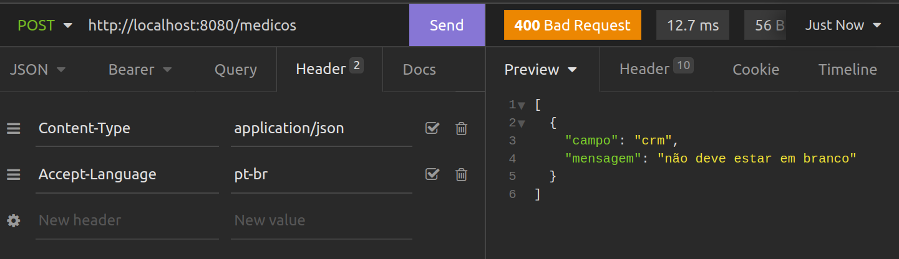

# Paginação
```java
    //    {{ _.baseURL }}/medicos?size=1&page=0
    //    {{ _.baseURL }}/medicos?sort=id,desc
    //    public ResponseEntity<Page<DadosListagemMedico>> listar(Pageable paginacao) {
    @GetMapping
    public ResponseEntity<Page<DadosListagemMedico>> listar(@PageableDefault(size = 10, sort = "nome") Pageable paginacao) {
        Page<Medico> medicos = repository.findAll(paginacao);
        return ResponseEntity.ok().body(medicos.map(DadosListagemMedico::new));
    }
```
- por padrão, os parâmetros utilizados para realizar a paginação e a ordenação são **page, size e sort**
  - modificar o nome padrão
```properties
spring.data.web.pageable.page-parameter=pagina
spring.data.web.pageable.size-parameter=tamanho
spring.data.web.sort.sort-parameter=ordem
```
# Validações (starter validation)
Modulo que integra com especificação java BeanValidation
- [Lista de anotations](https://jakarta.ee/specifications/bean-validation/3.0/jakarta-bean-validation-spec-3.0.html#builtinconstraints)
```java
public record DadosCadastroMedico(
    @NotBlank // não nulo e nem vazio
    String nome,
    @NotBlank
    @Email
    String email,
    @NotBlank
    @Pattern(regexp = "\\d{4,6}")
    String crm,
    @NotNull // não é not blank, pois not blank é so pra string
    Especialidade especialidade,
    @NotNull
    @Valid  DadosEndereco endereco //  valid diz que endereco tem validcoes e pra validar
) {
}
```
# Banco mysql
Configurações
```shell
spring.datasource.url=jdbc:mysql://localhost/vollmed_api
spring.datasource.username=root
spring.datasource.root=root
spring.datasource.driver-class-name=com.mysql.cj.jdbc.Driver
```
- habilitar log das queries
```properties
spring.jpa.show-sql=true
```
## Flyway
Adiciona migrations ao projeto
- cadança executada será criado arquivo .sql e lá escrever bloco de comando que será executado
- salvar em main/resources/db/migration
- para projeto durante a criação do arquivo
- segue um padrão de nomenclatura dos arquivos
  - V1__descricao.sql
### Erro por ter executado migration antecipadamente ao salvar arquivo
É importante parar o projeto ao criar os arquivos de migrations, para evitar que o Flyway os execute antes da hora, com o código ainda incompleto
- Esse erro também pode acontecer se o código da migration estiver inválido, contendo algum trecho de SQL digitado de maneira incorreta.
- Para resolver esse problema será necessário acessar o banco de dados da aplicação e executar o seguinte comando sql:
  - apagar na tabela do Flyway todas as migrations cuja execução falhou. Após isso, basta corrigir o código da migration e executar novamente o projeto.
```sql
delete from flyway_schema_history where success = 0;
```
- **Obs:** Pode acontecer de alguma migration ter criado uma tabela e/ou colunas e com isso o problema vai persistir, pois o flyway não vai apagar as tabelas/colunas criadas em migrations que falharam
  - Nesse caso você pode apagar o banco de dados e criá-lo novamente:
```sql
drop database vollmed_api;
create database vollmed_api; 
```
## [JPA Query Methods](https://docs.spring.io/spring-data/jpa/reference/jpa/query-methods.html)
# CORS (Cross-Origin Resource Sharing - "compartilhamento de recursos com origens diferentes")
- informam aos navegadores para permitir que uma aplicação Web seja executada em uma origem e acesse recursos de outra origem diferente.
  - chamada de requisição cross-****origin HTTP
- informa aos navegadores se um determinado recurso pode ou não ser acessado.

## Same-origin policy
- uma aplicação Front-end, escrita em JavaScript, só consegue acessar recursos localizados na mesma origem da solicitação
- mecanismo de segurança dos Browsers que restringe a maneira de um documento ou script de uma origem interagir com recursos de outra origem
- política possui o objetivo de frear ataques maliciosos.
- Ao enviar uma requisição para uma API de origem diferente, a API precisa retornar um header chamado Access-Control-Allow-Origin
  - Dentro dele, informar as diferentes origens que serão permitidas para consumir a API
    - Access-Control-Allow-Origin: http://localhost:3000.
    - É possível permitir o acesso de qualquer origem utilizando o símbolo *(asterisco)
      - Access-Control-Allow-Origin: *
    - Mas isso não é uma medida recomendada, pois permite que origens desconhecidas acessem o servidor, a não ser que seja intencional, como no caso de uma API pública
## Habilitando diferentes origens no Spring Boot
```java
@Configuration
public class CorsConfiguration implements WebMvcConfigurer {

    @Override
    public void addCorsMappings(CorsRegistry registry) {
        registry.addMapping("/**")
            .allowedOrigins("http://localhost:3000")
            .allowedMethods("GET", "POST", "PUT", "DELETE", "OPTIONS", "HEAD", "TRACE", "CONNECT");
    }
}
```

# Error
- não incluir stacktrace
```properties
server.error.include-stacktrace=never
```
- Personalizar retorno exception
```java
@RestControllerAdvice
public class TratadorErros {
    @ExceptionHandler(EntityNotFoundException.class)
    public ResponseEntity<Void> tratarErro404() {
        return ResponseEntity.notFound().build();
    }

    @ExceptionHandler(MethodArgumentNotValidException.class)
    public ResponseEntity<List<DadosErroValidacao>> tratarErroValidacao(MethodArgumentNotValidException exception) {
        var errors = exception.getFieldErrors();
        return ResponseEntity.badRequest().body(errors.stream().map(DadosErroValidacao::new).toList());
    }

    public record DadosErroValidacao(
            String campo,
            String mensagem
    ) {
        public DadosErroValidacao(FieldError error) {
            this(error.getField(), error.getDefaultMessage());
        }
    }
}
```
- Bean validation consegue traduzir as mensagem automaticamente passando parametro no header Accept-Language

## Personalizando mensagens de erro
- adicionando o atributo message nas próprias anotações de validação:

```java
public record DadosCadastroMedico(
        @NotBlank(message = "Nome é obrigatório")
        String nome
) {}
```
- isolando as mensagens em um arquivo de propriedades
  - que deve possuir o nome ValidationMessages.properties e ser criado no diretório src/main/resources:
```properties
nome.obrigatorio=Nome é obrigatório
```
```java
public record DadosCadastroMedico(
    @NotBlank(message = "{nome.obrigatorio}")
    String nome
) {}
```

# Spring security
1. autenticação
1. autorização (controle de acesso)
3. Proteção contra ataques (CSRF, clickjacking, etc)

## Diferneça statefull x stateless
1. Statefull (Autenticação em aplicações web)
- Session guardando estado do usuário
2. Stateless (Autenticação em API Rest)
- API Rest não deve guardar estados
  - servidor processa, devolve resposta e na próxima requisição não tem sessão
  - JWT (JSON web tokens)

## Autenticação
1. requisição com dados de login
2. API verifica se dados são validos (verifica database)
3. Gera JWT
4. Devolve JWT

## Validação token
1. Request enviando JWT
2. Valição JWT
3. Token válido? (se não bloqueia requisição)

## Funcionamento
So de adicionar depencia, ao iniciar projeto
  - cria uma senha pra ambiente de desenvolvimento ao iniciar projeto 
  - bloqueia todas requisições por padrão e redireciona para uma tela de login
    - Cria um usuário default com nome 'user' e password no log do console (ideal para aplicações statefull)
    - Spring security permite personalizar isso
```xml
<dependencies>
  <dependency>
      <groupId>org.springframework.boot</groupId>
      <artifactId>spring-boot-starter-security</artifactId>
  </dependency>
  <dependency>
      <groupId>org.springframework.security</groupId>
      <artifactId>spring-security-test</artifactId>
      <scope>test</scope>
  </dependency>
</dependencies>
```

## Implementação em API Rest
- Ao implementar não tem comportamento padrão e fornecer tela de login e bloquear todas requisições 
```java
@Service
public class AutenticacaoService implements UserDetailsService {
    @Autowired
    private UsuarioRepository repository;

    // loadUserByUsername - metodo que spring chama automaticamente ao fazer login
    @Override
    public UserDetails loadUserByUsername(String username) throws UsernameNotFoundException {
        return repository.findByLogin(username);
    }
}
```
```java
@Configuration
@EnableWebSecurity // indicar que irá personalizar configurações de segurança
public class SecurityConfigurations {
  // devolve o retorno do metodo
  @Bean
  public SecurityFilterChain securityFilterChain(HttpSecurity http) throws Exception {
    return http
            .csrf(AbstractHttpConfigurer::disable)
            .sessionManagement(session -> session.sessionCreationPolicy(SessionCreationPolicy.STATELESS))
            //.authorizeHttpRequests(req -> {
              // req.requestMatchers("/login").permitAll();
              // req.anyRequest().authenticated();
            // })
            .build();
  }

  @Bean
  public AuthenticationManager authenticationManager(AuthenticationConfiguration configuration) throws Exception {
    return configuration.getAuthenticationManager();
  }

  @Bean
  public PasswordEncoder passwordEncoder() {
    return new BCryptPasswordEncoder();
  }
}
```
```java
public class AutenticacaoController {
    // classe do proprio spring que dispara o processo de autenticação, chamando o nosso serviço AutenticacaoService
    @Autowired
    private AuthenticationManager manager;

    @PostMapping("/login")
    public ResponseEntity<Void> login(@RequestBody @Valid DadosAutenticacao dados) {
        var token = new UsernamePasswordAuthenticationToken(dados.login(), dados.senha());
        var authentication = manager.authenticate(token);

        return ResponseEntity.ok().build();
    }
}
```

## Controlando autorização
```java
@Bean
public SecurityFilterChain securityFilterChain(HttpSecurity http) throws Exception {
  return http.csrf().disable()
          .sessionManagement().sessionCreationPolicy(SessionCreationPolicy.STATELESS)
          .and().authorizeHttpRequests()
          .requestMatchers(HttpMethod.POST, "/login").permitAll()
          .requestMatchers(HttpMethod.DELETE, "/medicos").hasRole("ADMIN")
          .requestMatchers(HttpMethod.DELETE, "/pacientes").hasRole("ADMIN")
          .anyRequest().authenticated()
          .and().addFilterBefore(securityFilter, UsernamePasswordAuthenticationFilter.class)
          .build();
}
```
- com [Method Security](https://docs.spring.io/spring-security/reference/servlet/authorization/method-security.html)
```java
@GetMapping("/{id}")
@Secured("ROLE_ADMIN")
public ResponseEntity detalhar(@PathVariable Long id) {
  var medico = repository.getReferenceById(id);
  return ResponseEntity.ok(new DadosDetalhamentoMedico(medico));
} 
```
- **Atenção!**
  - Por padrão esse recurso vem desabilitado no spring Security, sendo que para o utilizar devemos adicionar a seguinte anotação na classe Securityconfigurations do projeto:
```java
@EnableMethodSecurity(securedEnabled = true)
```


# [JWT](https://jwt.io/libraries?language=Java)
- [Usado auth0](https://github.com/auth0/java-jwt)
```java
@Service
public class TokenService {
    public String gerarToken(Usuario usuario) {
        try {
            // HMAC256(senha secreta)
            Algorithm algorithm = Algorithm.HMAC256("12345678");
            return JWT.create()
                    .withIssuer("API Voll.med")
                    .withSubject(usuario.getLogin())
                    // .withClaim("id", usuario.getId())
                    .withExpiresAt(LocalDateTime.now().plusHours(2).toInstant(ZoneOffset.of("-03:00")))
                    .sign(algorithm);
        } catch (JWTCreationException exception){
            throw new RuntimeException("Erro ao gerar token jwt", exception);
        }
    }
}
```

# Filter x Interceptors 
- Toda requisição passa pelo filter
  - acabou chama servlet ou controller 
- DispatcherServlet
  - Classe servlet que recebe todas requisições e ele descobre qual controller vai chamar
    - entre servlet e controller, existe um filtro do spring chamando **Handler Interceptor**
      - que tem a mesma ideia de um filter (interceptar requisição antes de chamar contorller)
- Difernete entre os dois é
  - Interceptor é do spring
    - executado após requisição passar pelo DispatcherServlet
    - Consigo recuperar coisas do spring
    - Consegue saber qual controller vai ser chamado
    - Consegue usar injeção de dependencia
  - Filter não haver com spring
    - Executado antes do DispatcherServlet
    - Spring nem começa ser executado

## Criando middlewares
- filterChain.doFilter indica que os próximos filters, caso existam outros, podem ser executados
```java
// Filter (pacote jakarta.servlet)
@WebFilter(urlPatterns = "/api/**")
public class LogFilter implements Filter {

    @Override
    public void doFilter(ServletRequest servletRequest, ServletResponse servletResponse, FilterChain filterChain) throws IOException, ServletException {
        System.out.println("Requisição recebida em: " + LocalDateTime.now());
        filterChain.doFilter(servletRequest, servletResponse);
    }

}
```
- OncePerRequestFilter
  - essa classe do spring implementa Filter de servlet
  - classe do spring que garante que vai ser executada apenas uma unica vez pra cada requisição
```java

@Component
public class SecurityFilter extends OncePerRequestFilter {
    @Autowired
    private TokenService tokenService;

    @Autowired
    private UsuarioRepository repository;


    @Override
    protected void doFilterInternal(HttpServletRequest request, HttpServletResponse response, FilterChain filterChain) throws ServletException, IOException {
        var tokenJWT = recuperarToken(request);
        if (tokenJWT != null) {
            var subject = tokenService.getSubject(tokenJWT);
            // falar ao spring que está logado
            var usuario = repository.findByLogin(subject);
            var authentication = new UsernamePasswordAuthenticationToken(usuario, null, usuario.getAuthorities());
            SecurityContextHolder.getContext().setAuthentication(authentication);
        }


        filterChain.doFilter(request, response);
    }

    private String recuperarToken(HttpServletRequest request) {
        var authorizationHeader = request.getHeader("Authorization");
        if (authorizationHeader != null) {
            return authorizationHeader.replace("Bearer ", "");
        }

        return null;
    }
}
```
- No filter chain spring boot
```java
@Bean
public SecurityFilterChain securityFilterChain(HttpSecurity http) throws Exception {
    // configurar autorização, tem que estar logado pra fazer tudo, exceto login
    return http
            .csrf(AbstractHttpConfigurer::disable)
            .sessionManagement(session -> session.sessionCreationPolicy(SessionCreationPolicy.STATELESS))
            .authorizeHttpRequests(req -> {
                req.requestMatchers("/auth/login").permitAll();
                req.anyRequest().authenticated();
            })
            .addFilterBefore(securityFilter, UsernamePasswordAuthenticationFilter.class)
            .build();
}
```
# Dicas spring
## @Bean
Exportar uma classe para o spring, fazendo com que ele consiga carregá-la e realize a sua injeção em outras classes

## Variaveis ambiente
- :valor_default
```properties
api.security.token.secret=${JWT_SECRET:12345678}
```
```java
@Value("${api.security.token.secret}")
private String secret;
```

## @Component
- Spring carregar uma classe generica (não é serviço, interface, repository, config)
# Links
- [Trello com as funcionalidades](https://trello.com/b/O0lGCsKb/api-voll-med)
- [explicação CORS](https://cursos.alura.com.br/course/spring-boot-3-desenvolva-api-rest-java/task/116048)
- [Explicação classes recodd](https://cursos.alura.com.br/course/spring-boot-3-desenvolva-api-rest-java/task/116049)